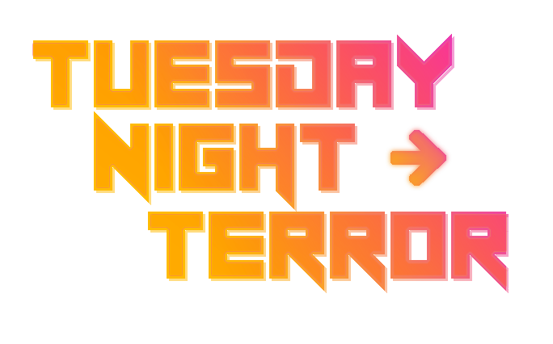

# TNT
A game im working on
<!-- tuesdaynighttorment -->!

<table style="width:100%; border: 1px solid black">
	<tr>
		<th style="text-align:left; border: 1px solid black"><h3>🖥 Programmer:</h3></th>
		<th style="text-align:left; border: 1px solid black"><h3>🖼 Artist:</h3></th>
		<th style="text-align:left; border: 1px solid black"><h3>🎶 Musician:</h3></th>
	</tr>
	<td style="border: 1px solid black">
		<a href='https://github.com/Th3SnowyOwl'><b>Th3SnowyOwl</b></a> 
		
	</td>
		<!-- Dont remove the space in the next table, its there to space out the text. -->
	<td style="border: 1px solid black">
		<a href='https://github.com/Th3SnowyOwl'><b>Th3SnowyOwl</b></a> 
		
	</td>
	<td style="border: 1px solid black">
		<a href='https://github.com/Th3SnowyOwl'><b>Th3SnowyOwl</b></a> 
		
	</td>
</table>
